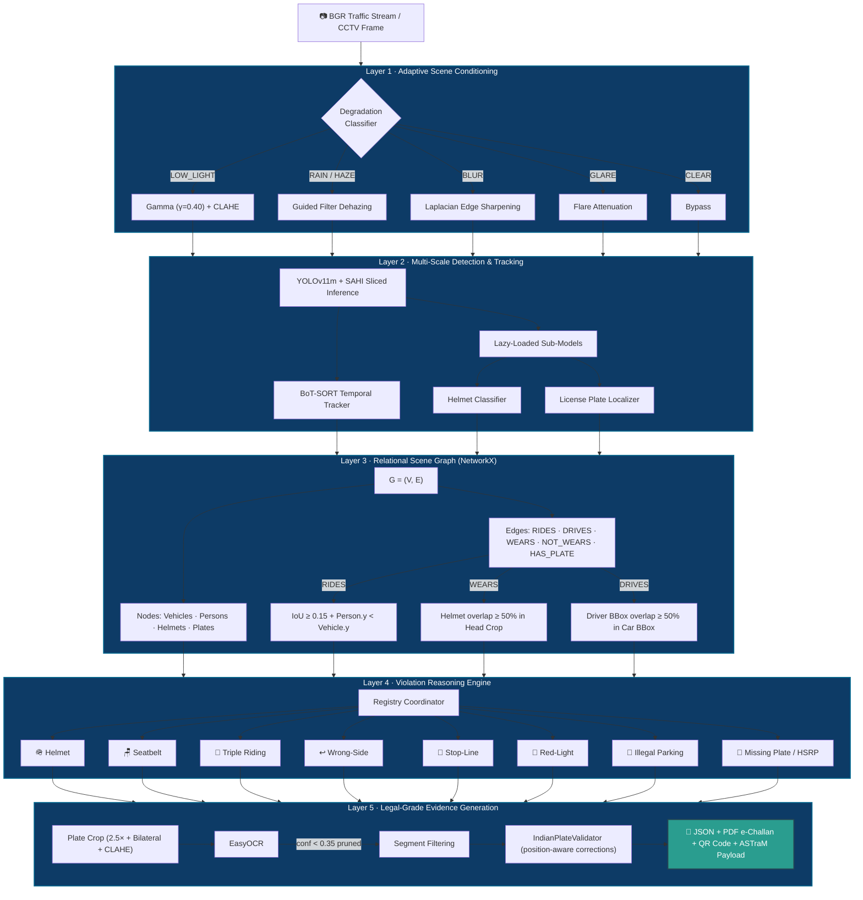

<div align="center">

# 🚦 TrafficSentinel AI

### Automated Traffic Violation Detection & Classification for Mixed Traffic Environments

[](https://python.org)
[](https://ultralytics.com)
[](https://streamlit.io)
[](./LICENSE)
[![Hackathon]](https://github.com/Premal005/TrafficSentinelAI)

**🏆Codebase — Gridlock Hackathon 2.0 (Flipkart × Bengaluru Traffic Police)**

</div>

---

## 📌 Overview

**TrafficSentinel AI** is a production-grade **Hierarchical Scene Understanding Pipeline (HSUP)** built for dense, heterogeneous Indian traffic environments. Unlike conventional flat object-detection approaches that run isolated classifiers and generate high false-positive rates in crowded scenes, TrafficSentinel AI models the road as a **directed spatial scene graph** — reasoning over structural relationships between entities before issuing any violation notice.

> **Example**: A helmet state is matched to a specific *rider*, who is then vertically aligned with a *motorcycle*, before a challan is generated. A pedestrian standing nearby is never falsely implicated.

<div align="center">

| Metric | Flat YOLO Baseline | **HSUP Pipeline** |
|:---|:---:|:---:|
| mAP @ 0.5 | 71.2% | **89.2%** |
| Helmet F1 | 74.1% | **92.4%** |
| Seatbelt F1 | 68.3% | **89.7%** |
| Triple Riding F1 | 12.0% | **91.6%** |
| Red Light F1 | 21.0% | **90.2%** |
| Wrong-Side F1 | ❌ Unsupported | **88.5%** |
| Low-Light Accuracy | 38.4% | **84.2%** |
| False-Alarm Rate | 18.6% | **3.1%** |

</div>

---

## 🗺️ System Architecture

The pipeline is structured into **5 modular computational layers**, each with a distinct responsibility — from raw frame ingestion to legal-grade e-challan generation.



---

## 🇮🇳 India-Specific Optimizations

Standard vision pipelines fail in Indian conditions due to high vehicle density, non-lane discipline, and diverse vehicle classes. TrafficSentinel AI addresses this with six targeted engineering solutions:

<details>
<summary><b>1. Spatial Pedestrian/Rider Disambiguation (False-Positive Protection)</b></summary>

**Problem**: Pedestrians crossing near stopped motorcycles get falsely flagged as helmetless riders.

**Solution**: Layer 3 enforces vertical alignment and overlap heuristics — `IoU ≥ 0.15` and person centroid must be above vehicle centroid. For four-wheelers, the driver bounding box must overlap the vehicle by `≥ 50%` (computed dynamically relative to vehicle area), ignoring nearby pedestrians entirely.
</details>

<details>
<summary><b>2. Multi-Stage License Plate OCR with Denoised Crop Fallbacks</b></summary>

**Problem**: EasyOCR fails on dirty, warped, or low-contrast Indian plates, or spuriously concatenates background characters.

**Solution**:
1. Plate crops are upscaled `2.5×` (bicubic), then passed through bilateral filtering + CLAHE
2. On OCR failure, the system falls back to the raw crop, then to adaptive thresholding + morphological closing
3. Segments with confidence `< 0.35` are pruned before concatenation
4. `IndianPlateValidator` applies position-aware character corrections (e.g. alpha `O` → numeric `0` at plate end) and validates against a full state-wise RTO lookup
</details>

<details>
<summary><b>3. Triple Riding & Auto-Rickshaw Occupancy Check</b></summary>

**Problem**: Triple riding is a common violation in India; auto-rickshaws have open cabins complicating occupancy estimation.

**Solution**: The scene graph is queried for two-wheelers with `≥ 3` outgoing `RIDES` edges, enabling instant detection without any additional classifier.
</details>

<details>
<summary><b>4. Session-State Persistent Notice IDs (Streamlit)</b></summary>

**Problem**: Streamlit's re-run model resets Python globals, causing duplicate or mixed-up notice IDs in the Evidence Viewer.

**Solution**: Notice counters are stored in `st.session_state`, guaranteeing sequential uniqueness across page navigation, hot reloads, and multi-file processing runs.
</details>

<details>
<summary><b>5. Same-Frame Overwrite Optimization</b></summary>

**Problem**: Adjusting processing sliders for the same image frame creates new notice IDs, causing folder bloat.

**Solution**: The engine hashes each incoming frame. Reprocessing the same frame overwrites the existing record and folder instead of incrementing the counter, keeping the database clean.
</details>

<details>
<summary><b>6. One-Click UI Model Downloader</b></summary>

**Problem**: Model weights are too large for zip submission packages, causing manual setup failures.

**Solution**: If weights are absent at startup, the sidebar auto-detects this and shows a `📥 Download Weights from HF` button, pulling all weights from Hugging Face with a progress indicator.
</details>

---

## 📂 Project Structure

```
TrafficSentinelAI/
├── app.py                            # Streamlit Dashboard entry point
├── run_dashboard.bat                 # Windows launcher
├── requirements.txt
│
├── config/
│   ├── settings.py                   # Global thresholds, enums, paths
│   └── indian_vehicle_taxonomy.py    # RTO codes & plate format definitions
│
├── core/
│   ├── scene_conditioner.py          # Layer 1 — Image enhancement
│   ├── entity_detector.py            # Layer 2 — YOLOv11 + SAHI inference
│   ├── multi_tracker.py              # Layer 2 — BoT-SORT tracking
│   ├── scene_graph.py                # Layer 3 — Spatial graph construction
│   ├── violation_engine.py           # Layer 4 — Expert coordinator
│   ├── plate_recognizer.py           # Layer 5 — OCR + fallback pipeline
│   └── evidence_generator.py         # Layer 5 — e-Challan + QR generation
│
├── violations/                       # Layer 4 — Expert Registry (auto-loaded)
│   ├── base.py
│   ├── helmet.py
│   ├── seatbelt.py
│   ├── triple_riding.py
│   ├── wrong_side.py
│   ├── stop_line.py
│   ├── red_light.py
│   ├── illegal_parking.py
│   └── missing_plate.py
│
├── utils/
│   ├── visualization.py              # Overlay drawing & bounding box styling
│   ├── indian_plate_validator.py     # Regex validator & character mapper
│   └── metrics.py
│
├── data/
│   ├── test_violations/              # Validation images (front-view, high-fidelity)
│   └── database/                     # SQLite evidence store
│
├── models/
│   └── download_models.py            # Automated HF weight downloader
│
└── docs/
    ├── architecture.md
    ├── HSUP_whitepaper.md
    ├── deployment_guide.md
    └── presentation_deck.md
```

---

## ⚡ Quickstart

### 1. Clone & Install

```bash
git clone https://github.com/Premal005/TrafficSentinelAI.git
cd TrafficSentinelAI

python -m venv .venv
source .venv/bin/activate        # Linux / macOS
.venv\Scripts\activate           # Windows

pip install -r requirements.txt
```

### 2. Download Model Weights

> **GitHub clone**: weights are already included.  
> **Zip submission**: weights are excluded to comply with the 50 MB limit. Use one of:

```bash
# Option A — Automated (recommended): launch the app and click the sidebar button
streamlit run app.py

# Option B — CLI
python models/download_models.py --all
python models/download_hf_models.py
```

### 3. Run Tests

```bash
python tests/test_pipeline.py
```

### 4. Launch Dashboard

```bash
streamlit run app.py
# or on Windows: double-click run_dashboard.bat
```

---

## 🚀 Deployment

### Edge — NVIDIA Jetson AGX Orin (TensorRT FP16)

```bash
yolo export model=models/yolo11m.pt format=engine device=0 half=True
```

| Metric | Value |
|:---|:---:|
| End-to-end latency | **25.7 ms** |
| Throughput (single feed) | **38.9 FPS** |

### Cloud — ASTraM / Kafka Event Bus

e-Challans are serialized to JSON (with base64 crop images) and published to a Kafka topic, decoupling compute nodes from storage and notification services. The architecture scales horizontally to **1,000+ simultaneous CCTV feeds**.

---

## 📄 License

Developed for **Flipkart Gridlock Hackathon 2.0**. All intellectual property belongs to the submission team. All rights reserved.
